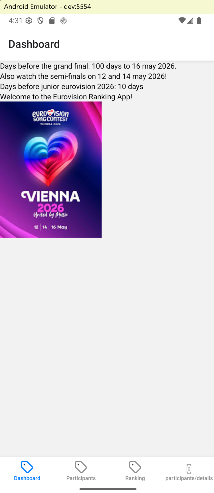
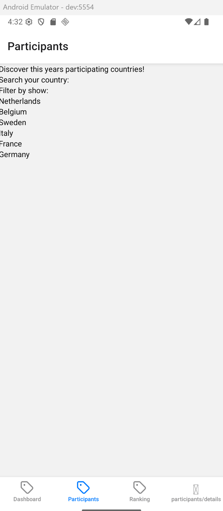

# Permanente evaluatie

## Scherm 1 Dashboard

_Dit is het dashboard waarop de gebruiker verwelkomt wordt. Op deze pagina is een aftelklok te zien tot de finale van het
eerstvolgende festival. Daaronder ook de datums van de halve finales. Ook de uitzending van de junior versie wordt vermeld.
Daarnaast is er ook een welkomstboodschap te vinden. Onderaan het scherm bevinden zich drie knoppen, als eerste een knop om 
weer naar het dashboard te navigeren, en daarnaast een om naar het scherm deelnemers te gaan, de ander om naar het scherm 
beoordelen van deelnemers te gaan. De resterende ruimte van het scherm wordt ingevuld door een fotoslider met sfeerbeelden 
van het songfestival. Optioneel worden deze sfeerbeelden vervangen door een social media feed van instagram._

## Scherm 2 Deelnemers

_Op dit scherm worden de deelnemende landen opgelijst. Dit gebeurt op basis van de vlaggen van ieder land met naam erbij.
Als er lang op een land gedrukt wordt (gesture), word de gebruiker doorverwezen naar een detail pagina met daarop meer
informatie over de deelnemer. Dit wordt met lang drukken gedaan omdat met het scrollen van de lijst korte clicks niet zo handig
zijn. Er kan ook gefilterd worden. Het is mogelijk met een zoekbalk snel het juiste land op te zoeken, of de deelnemende
landen te filteren op basis van finale en halve finales._

## Scherm 3 Deelnemers Details

_Nadat een gebruiker lang op een deelnemend land gedrukt heeft, komt de gebruiker op dit scherm terecht. Hier worden de 
details van het deelnemend land getoond. De titel van het nummer, volledige naam de artiest, leeftijd artiest, al eerder 
deelnemer geweest, etc. Daarnaast wordt hier gebruik gemaakt van expo-sharing, om een lied te kunnen sharen. Dit kan door 
op een knop te drukken "Share Finlands song!"_

## Scherm 4 Ranking

_Op dit scherm wordt de ranking getoond. Er wordt een invulveld getoond waar gezocht kan worden op de landen. Deze worden
weergegeven als een select list. Daarna kan in een ander invulveld een score worden gegeven (1, 2, 3, 4, 5, 6, 7, 8, 9, 10
11 en de befaamde douze points). Deze worden vervolgens in een lijst weergegeven onder de invulvelden. Als een ranking 
wordt toegevoegd, refresht de ranking met een mooie animatie._

## Native modules

_Als eerste native module gaat expo-notifications gebruikt worden. Als de finale op het punt van beginnen staat, word er
een pushmelding verstuurt, om de gebruiker op de hoogte te stellen dat de finale gaat beginnen. Optioneel wordt dit uitgebreid
naar de halve finales en het Junior Eurovisie Songfestival. Hiernaast wordt gebruik gemaakt van de eerder besproken module
expo-sharing om de liedjes te kunnen delen met anderen._

## Online services

_Als online services worden een API gebruikt om de data van de songfestivals op te halen. Deze worden dan ingeladen in het scherm
deelnemende landen. Indien het werken met API problemen geeft, kan er terug gevallen worden op een eigen database. Dat wordt
dan de supabase database die gebruikt wordt om de data van de rankings op te slaan._

## Gestures & animaties

_De long press die gebruikt wordt om de details pagina te openen vanuit de deelnemers pagina, is de gesture die in de app
verwerkt wordt. Als animatie wordt een refresh op de ranking pagina voorzien._

# Feedback
Ziet er over het algemeen goed uit! 

Enkele kleine feedback puntjes:
- Het design mag zeker nog een kleine upgrade krijgen, maar het is duidelijk uit je omschrijving dat je dit van plan bent.
- Een long press om een detailpagina te openen is niet ideaal. Acties die je normaal met 1 klik doet zet je best niet in een long press.
  - Ik zou je refresh-actie gewoon voor beiden gebruiken: swipe-down als gesture en je view naar beneden halen en terug naar boven laten 'bouncen' als animatie.

Voor de rest heel goede voorstellen! Succes met de uitwerking!