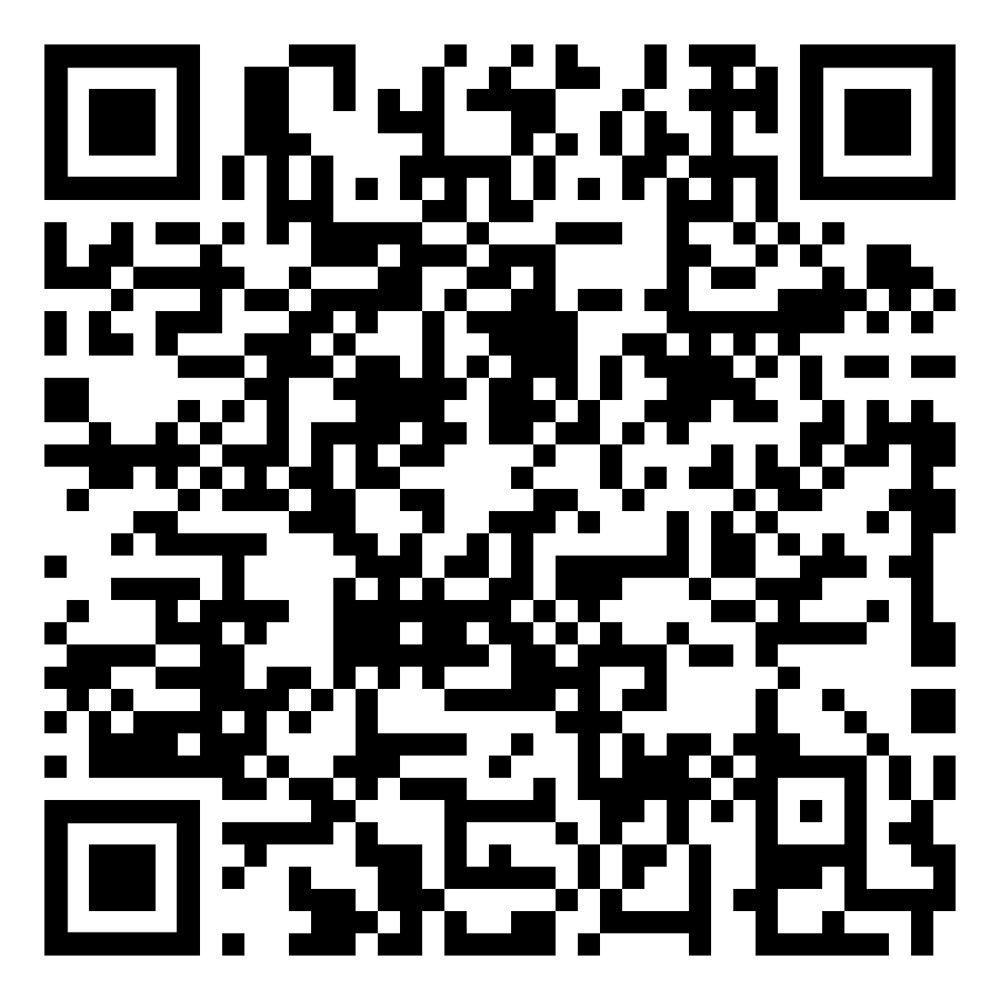

# 🎤 EuroScore - Your Ultimate Eurovision Companion

**EuroScore** is a high-performance React Native application designed for the ultimate Eurovision experience. With this app, fans can track countdowns to the major shows, view participants, and manage their own personal ranking using the official scoring system.

---

## 🚀 Key Features

- **Dynamic Show Timers:** Real-time countdowns to the semi-finals and the grand final, including live status updates while the show is in progress and after it has concluded.
- **Interactive Ranking:** Assign points to countries. The list automatically re-orders itself in real-time based on your personal score.
- **Smart Validation:** Prevents duplicate points; the app intelligently detects if you have already assigned a specific score to another country.
- **Haptic Feedback:** Physical vibrations when awarding "Douze Points" (12 points) for an immersive and rewarding user experience.
- **Smart Notifications:** Automatic reminders scheduled 15 minutes before the start of every event.
- **Advanced Pull-to-Refresh:** A custom animated refresh experience built with `React Native Reanimated`.

---

## 🛠️ Tech Stack

- **Framework:** [Expo](https://expo.dev/) with [React Native](https://reactnative.dev/)
- **Data & Backend:** [Supabase](https://supabase.com/)
- **State Management:** [TanStack Query v5](https://tanstack.com/query/latest)
- **Performance Lifts:** [LegendList](https://legendapp.com/open-source/list/) for highly optimized list rendering.
- **Animations:** [Reanimated 3](https://docs.swmansion.com/react-native-reanimated/) & [Gesture Handler](https://docs.swmansion.com/react-native-gesture-handler/).
- **Date Handling:** [date-fns](https://date-fns.org/) for accurate countdown calculations.

---

## 📱 Installation & Demo (Android)

You can test the app directly on an Android device:

1. **Download the APK:** Scan the QR code below or download the file manually via [GitHub Releases](https://github.com/ReinoutvanderWulp/EuroScore/releases).
2. **Installation:** Open the `.apk` file on your phone. Allow "Installation from unknown sources" if prompted by your system.

---

## 👨‍💻 Author
**Reinout van der Wulp** - Project Mobile Development 2026
